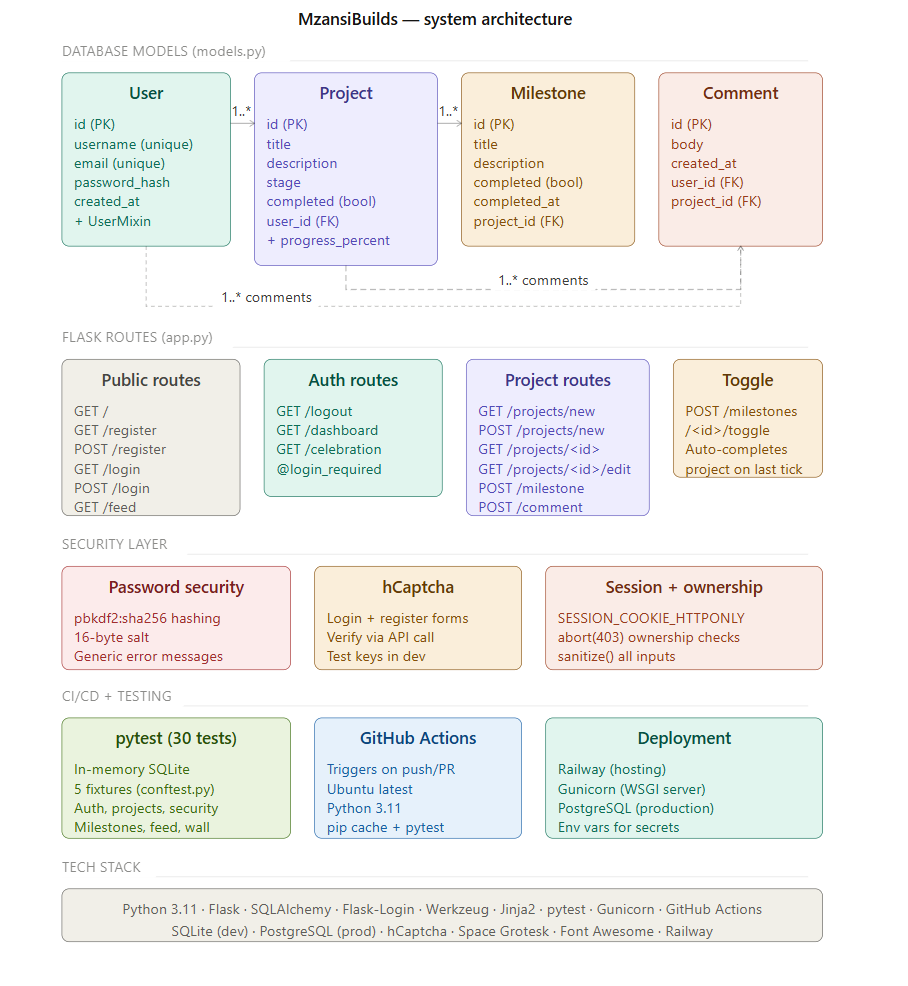
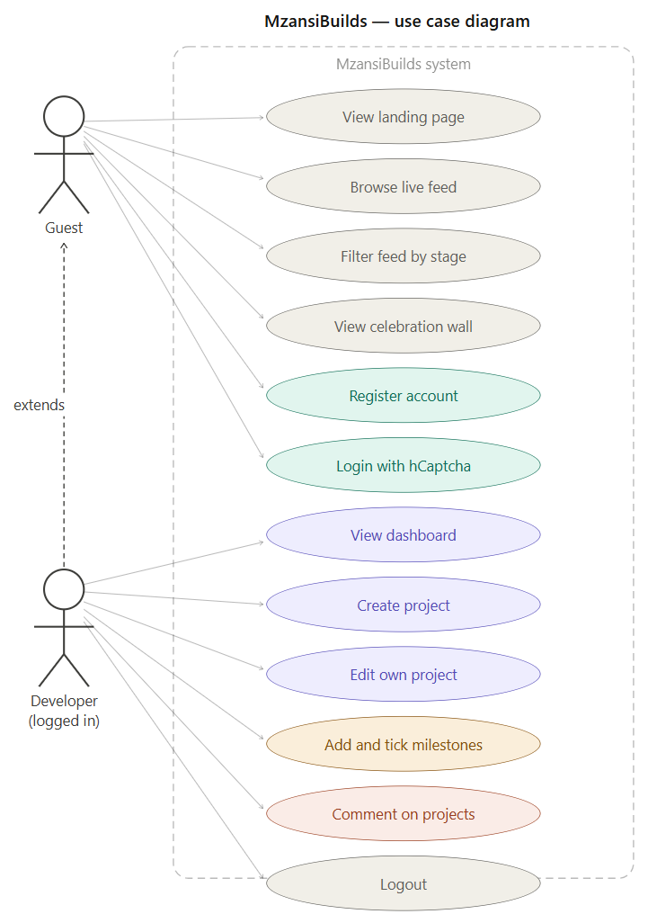

# MzansiBuilds


A platform where South African developers build in public, track their progress, and collaborate in the open. Built for the **Derivco Code Skills Challenge 2026**.

The website has been publicly deployed using railway, You can access it at https://web-production-16fc9.up.railway.app. Please note that you can also install and run the version directly on your computer. The application is meant to be displayed on larger screen sizes but small screen sizes like phones have also been taken into account. The public deployment of the site was to show continous development skills. 

---

## What it does

- **Developer profiles** — register an account and manage your public presence
- **Project tracking** — create project entries with a stage, description and support needed
- **Milestone system** — break projects into milestones and tick them off as you go. When the last milestone is completed, the project auto-completes and moves to the Celebration Wall
- **Live feed** — see what every developer is building in real time, filtered by stage
- **Comments** — leave feedback or offer collaboration on any project
- **Celebration Wall** — completed projects are featured publicly as proof that SA developers ship
- **Bot protection** — hCaptcha on login and register to prevent automated abuse

## Architecture



## Use case diagram


---

## Tech Stack

| Layer | Technology |
|---|---|
| Backend | Python 3.11 + Flask |
| Database | SQLite via Flask-SQLAlchemy |
| Authentication | Flask-Login + Werkzeug password hashing |
| Templates | Jinja2 |
| Frontend | HTML, CSS, Space Grotesk font, Font Awesome icons |
| Bot protection | hCaptcha |
| Testing | pytest |
| CI/CD | GitHub Actions |
| Deployment | Railway + Gunicorn |

---

## Running locally

```bash
# Clone the repo
git clone https://github.com/daylennaidoo565-web/Daylen_mzansibuilds.git
cd Daylen_mzansibuilds

# Create and activate virtual environment
python -m venv venv

# Windows:
venv\Scripts\activate

# Mac / Linux:
# source venv/bin/activate

# Install dependencies
pip install -r requirements.txt

# Run the app
python app.py
```

Then open `http://127.0.0.1:5000` in your browser.

---

## Running the tests

```bash
pytest tests/ -v
```

30 tests covering authentication, project CRUD, milestone tracking, ownership checks, feed visibility and the Celebration Wall.

---

## Security measures

- Passwords hashed with `pbkdf2:sha256` — never stored in plain text
- Generic login error messages to prevent user enumeration
- `@login_required` on all protected routes
- Ownership checks with `abort(403)` on edit/delete actions
- hCaptcha bot protection on login and register
- `SESSION_COOKIE_HTTPONLY` prevents JavaScript from accessing session cookies
- All user input sanitised before saving to the database
- Sensitive config (SECRET_KEY, hCaptcha keys) loaded from environment variables — never hardcoded

---

## AI Usage Disclosure

Claude (Anthropic) was used as a coding assistant throughout this project for:
- Scaffolding Flask routes and database models
- Generating pytest test stubs
- Debugging CI/CD configuration
- Formatting and commenting HTML templates

All architectural decisions, design choices, security considerations, code reviews and understanding of the codebase are my own. Every file has been read, understood and commented by me before committing. Commit messages reflect my own understanding of each change made.
